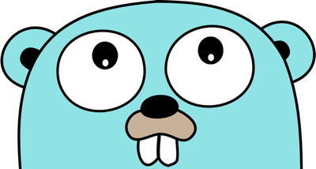

<!-- Improved compatibility of наверх link: See: https://github.com/othneildrew/Best-README-Template/pull/73 -->
<a id="readme-top"></a>
<!--
*** Thanks for checking out the Best-README-Template. If you have a suggestion
*** that would make this better, please fork the repo and create a pull request
*** or simply open an issue with the tag "enhancement".
*** Don't forget to give the project a star!
*** Thanks again! Now go create something AMAZING! :D
-->


<!-- PROJECT SHIELDS -->
<!--
*** I'm using markdown "reference style" links for readability.
*** Reference links are enclosed in brackets [ ] instead of parentheses ( ).
*** See the bottom of this document for the declaration of the reference variables
*** for contributors-url, forks-url, etc. This is an optional, concise syntax you may use.
*** https://www.markdownguide.org/basic-syntax/#reference-style-links
-->


<!-- PROJECT LOGO -->
<br />
<div align="center">
  <a href="https://github.com/Rivatent/private-go-test-task">
    
  </a>

<h3 align="center">Микросервисная система рекомендаций</h3>

  <p align="center">
    Тестовое задание на позицию Go-разработчика стажера
    <br />
  <a href="https://github.com/Rivatent/private-go-test-task/openapi.yaml"><strong>Документация по проекту »</strong></a>
    <br />
    <br />
    <a href="https://github.com/Rivatent/private-go-test-task">Демонстрационное видео</a>
  </p>
</div>


<!-- TABLE OF CONTENTS -->
<details>
  <summary>Оглавление</summary>
  <ol>
    <li><a href="#о-проекте">О проекте</a></li>
    <li><a href="#начало-работы">Начало работы</a></li>
    <li><a href="#тестирование">Тестирование</a></li>
    <li><a href="#документация">Документация</a></li>
    <li><a href="#архитектура">Архитектура</a></li>
    <li><a href="#конфигурация-сервисов">Конфигурация сервисов</a></li>
    <li><a href="#Контакты">Контакты</a></li>
  </ol>
</details>


<!-- ABOUT THE PROJECT -->
## О проекте

Система рекомендаций для пользователей состоит из нескольких микросервисов, которые взаимодействуют между собой с использованием Apache Kafka, реляционной базы данных и кэша для улучшения производительности. Все компоненты системы запускаются с помощью Docker Compose.

<p align="right">(<a href="#readme-top">наверх</a>)</p>


### Использованные технологии

- [Go](https://golang.org/)
- [Apache Kafka](https://kafka.apache.org/)
- [Zookeeper](https://zookeeper.apache.org/)
- [PostgreSQL](https://www.postgresql.org/)
- [Redis](https://redis.io/)
- [Prometheus](https://prometheus.io)
- [Docker](https://www.docker.com/)
- [Docker Compose](https://docs.docker.com/compose/)
- [Gin](https://github.com/gin-gonic/gin)
- [Validator V10](https://pkg.go.dev/github.com/go-playground/validator/v10)
- [Zap Logger](https://github.com/uber-go/zap)

<p align="right">(<a href="#readme-top">наверх</a>)</p>


<!-- GETTING STARTED -->
## Начало работы

### Перед началом наботы

Убедитесь, что на вашей системе установлены следующие компоненты:
- **Docker** (версия 19.03.0+)
- **Docker Compose** (версия  1.25.0+)
- Доступ к сети интернет для загрузки образов


### Использование

Клонируйте репозиторий

```sh
git clone https://gitverse.ru/sbertech_hr/Go-internship-PavelRalchenkov
cd Go-internship-PavelRalchenkov
```
Каждый микросервис использует .env файл для конфигурации. 
Измените соответствующие файлы для всех микросервисов (user-
service/.env, product-service/.env, analytics-service/.env, 
recommendation-service/.env), в соответствии с желаемыми настройками.

Для запуска всех компонентов выполните следующую команду:
```sh
make run
```
  или
```sh
docker-compose up --build -d
```
Для остановки всех компонентов выполните:
```sh
make stop
```
    или
```sh
docker-compose down
```

<p align="right">(<a href="#readme-top">наверх</a>)</p>


<!-- TESTING -->
## Тестирование
Для тестирования API выполните запросы к эндпоинтам микросервисов с помощью любого HTTP-клиента, например Postman или curl.

Подробное описание всех эндпоинтов можно найти в документации **openapi.yaml**, 
а также их протестировать.

Проект покрыт юнит-тестами. Для их запуска выполните команду:
```sh
make tests
```

## Документация
Для подробной информации о API см. [документацию OpenAPI](https://github.com/Rivatent/private-go-test-task/openapi.yaml).

## Архитектура
### Общее описание
Система рекомендаций построена на основе микросервисной архитектуры, 
где каждая часть системы отвечает за конкретную бизнес-логику. 
Микросервисы взаимодействуют друг с другом через брокер сообщений
(Apache Kafka), данные храняться в реляционной БД (PostgreSQL), для увеличения
производительности сервиса рекомендаций используется кэширование(Redis) частых
запросов. С помощью системы мониторинга (Prometheus) собираются метрики по
количеству запросов и времени их обработки для каждого микросервиса.

### Компоненты системы

#### User Service
- Отвечает за управление пользователями (регистрация, обновление профиля, получение информации).
- Отправляет события о создании и обновлении пользователей в Kafka (темы `user_update`, `user_new`).

#### Product Service
- Управляет данными о продуктах (создание, обновление, удаление).
- Отправляет события в Kafka при изменении данных о продуктах (темы `product_update`, `product_new`).

#### Recommendation Service
- Подписывается на темы `user_new` и `product_updates`, `product_new` в Kafka.
- Генерирует персонализированные рекомендации на основе активности пользователей и популярности продуктов.
- Хранит рекомендации в базе данных.
- Предоставляет REST API для получения рекомендаций.

#### Analytics Service
- Подписывается на темы событий других сервисов.
- Собирает статистику:
    - Количество пользователей и продуктов.
    - Популярность продуктов.
    - Производит расчет рейтинга прогрессии продаж и прироста пользователей
- Обновляет данные аналитики в базе данных.

#### Кэш (Redis)
- Кэширует результаты запросов к рекомендациям.
- Используется для снижения нагрузки на базу данных и ускорения ответов на запросы.

#### Брокер сообщений (Kafka)
- Асинхронно передает события между микросервисами.

#### База данных (PostgreSQL)
- Хранит структурированные данные:
    - Пользователи.
    - Продукты.
    - Рекомендации.
    - Аналитика.

#### Система мониторинга (Prometheus)
- Собирает метрики со всех микросервисов:
    - Общее количество запросов
    - Время обработки запроса

### Взаимодействие между микросервисами

1. **Регистрация или обновление пользователя**:
    - User Service отправляет событие в Kafka (`user_update`, `user_new`).
    - Recommendation Service обновляет данные для рекомендаций.
    - Analytics Service собирает данные для обновления аналитики.

2. **Добавление или обновление продукта**:
    - Product Service отправляет событие в Kafka (`product_update`, `product_new`).
    - Recommendation Service обновляет данные для рекомендаций.
    - Analytics Service фиксирует изменения для аналитики.

3. **Генерация рекомендаций**:
    - Recommendation Service:
        - Получает данные о пользователях и продуктах через Kafka.
        - Анализирует популярность продуктов.
        - Кэширует часто запрашиваемые рекомендации в Redis.

4. **Сбор аналитики**:
    - Analytics Service:
        - Подписывается на темы `user_new` и `product_update`, `product_new`.
        - Анализирует собранные данные и обновляет статистику в базе данных.

## Конфигурация сервисов

### 1. PostgreSQL
- **Образ**: `postgres:17.0`
ных для хранения данных пользователей, продуктов, рекомендаций и аналитики.
- **Настройки**:
    - База данных: `db`
    - Пользователь: `user`
    - Пароль: `password`
    - Скрипты инициализации: `./init-scripts:/docker-entrypoint-initdb.d`
    - Порт: `5433` (проброшен на хостовую машину)
- **Healthcheck**:
    - Команда проверки: `pg_isready -U rivatent -d mydb`
    - Интервал: 10 секунд
    - Таймаут: 5 секунд
    - Повторы: 5

### 2. Zookeeper
- **Образ**: `confluentinc/cp-zookeeper:latest`
- **Описание**: Координатор для Kafka-брокера.
- **Настройки**:
    - Порт клиента: `2181`
    - Tick Time: `2000`
    - Порт: `22181` (проброшен на хостовую машину)
- **Healthcheck**:
    - Команда проверки: `echo "ruok"`
    - Интервал: 10 секунд
    - Таймаут: 5 секунд
    - Повторы: 3

### 3. Kafka
- **Образ**: `confluentinc/cp-kafka:latest`
- **Описание**: Брокер сообщений для взаимодействия между микросервисами.
- **Настройки**:
    - ID брокера: `1`
    - Zookeeper: `zookeeper:2181`
    - Протокол: `PLAINTEXT`
    - Порты:
        - `29092` (проброшен на хостовую машину)
    - Репликация топиков: `1`
- **Healthcheck**:
    - Команда проверки: `kafka-topics --bootstrap-server kafka:29092 --list | grep -q 'user_new'`
    - Интервал: 30 секунд
    - Таймаут: 10 секунд
    - Повторы: 3
- **Команда инициализации**:
    - Создание топиков:
        - `product_update`
        - `product_new`
        - `user_update`
        - `user_new`


### 4. Kafka UI
- **Образ**: `provectuslabs/kafka-ui`
- **Описание**: Графический интерфейс для мониторинга Kafka.
- **Настройки**:
    - Кластеры:
        - Имя: `local`
        - Серверы: `kafka:29092`
        - Zookeeper: `zookeeper:2181`
    - Порт: `8090` (проброшен на хостовую машину)
- **Рестарт**: Автоматический при сбоях.

### 5. Redis
- **Образ**: `redis:latest`
- **Описание**: Кэш для повышения производительности.
- **Настройки**:
    - Порт: `6379` (проброшен на хостовую машину)
- **Healthcheck**:
    - Команда проверки: `redis-cli ping`
    - Интервал: 5 секунд
    - Таймаут: 5 секунд
    - Повторы: 5


### 6. User Service
- **Описание**: Микросервис для управления пользователями.
- **Сборка**:
    - Путь к контексту: `./user-service`
    - Dockerfile: `Dockerfile`
- **Настройки**:
    - Порт: `8081` (проброшен на хостовую машину)
    - Файл окружения: `./user-service/.env`
- **Зависимости**:
    - PostgreSQL
    - Kafka
    - Zookeeper
    - Redis
    - Prometheus
    - Проверяется состояние через `healthcheck`.


### 7. Product Service
- **Описание**: Микросервис для управления продуктами.
- **Сборка**:
    - Путь к контексту: `./product-service`
    - Dockerfile: `Dockerfile`
- **Настройки**:
    - Порт: `8082` (проброшен на хостовую машину)
    - Файл окружения: `./product-service/.env`
- **Зависимости**:
    - PostgreSQL
    - Kafka
    - Zookeeper
    - Redis
    - Prometheus
    - Проверяется состояние через `healthcheck`.


### 8. Recommendation Service
- **Описание**: Микросервис для генерации рекомендаций.
- **Сборка**:
    - Путь к контексту: `./recommendation-service`
    - Dockerfile: `Dockerfile`
- **Настройки**:
    - Порт: `8083` (проброшен на хостовую машину)
    - Файл окружения: `./recommendation-service/.env`
- **Зависимости**:
    - PostgreSQL
    - Kafka
    - Zookeeper
    - Redis
    - Prometheus
    - Проверяется состояние через `healthcheck`.


### 9. Analytics Service
- **Описание**: Микросервис для сбора аналитики.
- **Сборка**:
    - Путь к контексту: `./analytics-service`
    - Dockerfile: `Dockerfile`
- **Настройки**:
    - Порт: `8084` (проброшен на хостовую машину)
    - Файл окружения: `./analytics-service/.env`
- **Зависимости**:
    - PostgreSQL
    - Kafka
    - Zookeeper
    - Redis
    - Prometheus
    - Проверяется состояние через `healthcheck`.

### 10. Prometheus
- **Образ**: `prom/prometheus:latest`
- **Описание**: Система мониторинга.
- **Настройки**:
    - Порт: `9090` (проброшен на хостовую машину)
    - Хранилище данных: - `./prometheus:/prometheus`
- **Конфигурация**:
    - Интервал сбора метрик: 5с
    - Сбор метрик: со всех микросервисов
- **Healthcheck**:
    - Команда проверки: `["CMD", "wget", "--spider", "http://localhost:9090/-/healthy"]`
    - Интервал: 10 секунд
    - Таймаут: 5 секунд
    - Повторы: 3

<!-- CONTACT -->
## Контакты

Павел Ральченков - [@paulralchenkov](https://t.me/paulralchenkov) - paulralchenkov@gmail.com

<!-- PROJECT LOGO -->
<br />
<div align="center">
  <a href="https://t.me/paulralchenkov">
    
  </a>
<p align="right">(<a href="#readme-top">наверх</a>)</p>


<!-- MARKDOWN LINKS & IMAGES -->
<!-- https://www.markdownguide.org/basic-syntax/#reference-style-links -->
[contributors-shield]: https://img.shields.io/github/contributors/Rivatent/private-go-test-task.svg?style=for-the-badge
[contributors-url]: https://github.com/Rivatent/private-go-test-task/graphs/contributors
[forks-shield]: https://img.shields.io/github/forks/Rivatent/private-go-test-task.svg?style=for-the-badge
[forks-url]: https://github.com/Rivatent/private-go-test-task/network/members
[stars-shield]: https://img.shields.io/github/stars/Rivatent/private-go-test-task.svg?style=for-the-badge
[stars-url]: https://github.com/Rivatent/private-go-test-task/stargazers
[issues-shield]: https://img.shields.io/github/issues/Rivatent/private-go-test-task.svg?style=for-the-badge
[issues-url]: https://github.com/Rivatent/private-go-test-task/issues
[license-shield]: https://img.shields.io/github/license/Rivatent/private-go-test-task.svg?style=for-the-badge
[license-url]: https://github.com/Rivatent/private-go-test-task/blob/master/LICENSE.txt
[product-screenshot]: images/usrs.png

